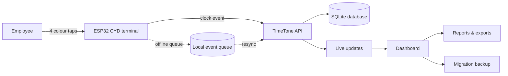
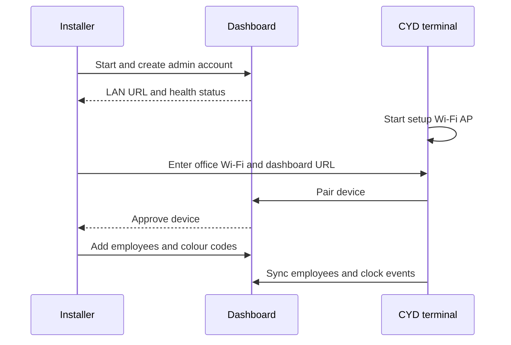

# TimeTone

<p align="center">
  
</p>

<p align="center"><strong>Office time, beautifully tracked.</strong><br>
An offline-first time clock for the ESP32-2432S032 CYD and a polished self-hosted dashboard.</p>

<p align="center">
  <a href="https://github.com/PolderLabsVOF/TimeTone/releases"></a>
  <a href="https://github.com/PolderLabsVOF/TimeTone/actions/workflows/ci.yml"></a>
  <a href="https://github.com/PolderLabsVOF/TimeTone/blob/main/LICENSE"></a>
  <a href="https://github.com/PolderLabsVOF/TimeTone"></a>
</p>

TimeTone gives a small team a fast, friendly way to clock in and out. An
employee taps their four-colour code on the terminal; the server records the
event, rounds time to your configured interval, and updates the live office
overview. Wi-Fi outages do not lose punches: the terminal queues events and
synchronises when connectivity returns.

## Product overview



| Area | Included |
| --- | --- |
| Terminal | LVGL portrait UI, always-visible four-colour keypad, clear button, setup AP, offline queue, low-power and screen-off modes |
| Attendance | Automatic clock-in/out, 15-minute rounding (configurable), duplicate protection, auto-close, auto-merge, manual corrections |
| Dashboard | Live overview, office presence canvas, employees, devices, entries, events, reports, dark mode, responsive layouts |
| Operations | Device approval, configurable terminal settings, USB Web Serial firmware updates, GitHub release updater |
| Data | CSV exports, audit trail, complete workspace migration import/export, persistent SQLite storage |

## Screenshots

These screenshots show a fictional Northstar Studio workspace populated with
demo employees and attendance. They are illustrative; no real employee data is
included. To recreate a similar local workspace, see [`docs/demo-data.sql`](docs/demo-data.sql).

<p align="center">
  
  
</p>
<p align="center">
  
  
</p>

## Install in one command

On Debian or Ubuntu, this interactive installer can install missing host
dependencies as well as TimeTone. It downloads the latest repository into
`./TimeTone`, then offers Docker or native Node.js installation:

```bash
curl -fsSL https://raw.githubusercontent.com/PolderLabsVOF/TimeTone/main/install.sh | sh
```

The installer asks for:

1. Deployment mode — Docker or native Node.js
2. Admin password (hidden input, minimum 8 characters)
3. Office timezone (IANA format, for example `Europe/Amsterdam`)
4. LAN port (default `3000`)

It finishes with a health check and prints the exact LAN URL and port.

Native installs download the production bundle attached to the latest GitHub
release, so Node.js users do not need to compile the dashboard locally. Docker
deployments load the prebuilt image and retain the persistent data volume.
Release web assets target Linux x86-64. Native installations require Node.js 24
and glibc 2.36 or newer (Debian 12 / Ubuntu 24.04 or newer). Docker avoids the
host glibc requirement. Other architectures are not covered by these binaries.

Choose a mode explicitly:

```bash
curl -fsSL https://raw.githubusercontent.com/PolderLabsVOF/TimeTone/main/install.sh | sh -s -- --docker
curl -fsSL https://raw.githubusercontent.com/PolderLabsVOF/TimeTone/main/install.sh | sh -s -- --native
```

For automation:

```bash
curl -fsSL https://raw.githubusercontent.com/PolderLabsVOF/TimeTone/main/install.sh | \
  TIMETONE_ADMIN_PASSWORD='use-a-long-unique-password' \
  TIMEKEEP_TIMEZONE='Europe/Amsterdam' TIMETONE_PORT=3000 \
  sh -s -- --docker --non-interactive
```

Set `TIMETONE_INSTALL_DIR` to choose another installation directory. Native
installs require Node.js 20.9+ and npm; Debian/Ubuntu installs bootstrap
Node.js 24 automatically. Native installs use a systemd user service to start
the dashboard after reboot. See [deployment and operations](docs/DEPLOYMENT.md)
for non-Debian systems, HTTPS, services, backups, and security.

## First setup



1. Open the printed dashboard URL and sign in.
2. Add employees under **Employees** and assign each a four-colour code.
3. Flash a terminal using the [firmware guide](firmware/README.md).
4. Join the displayed `TimeTone-XXXX` setup network (default password:
   `timekeep`) and visit `http://192.168.4.1`.
5. Enter the office 2.4 GHz Wi-Fi and dashboard URL.
6. Approve the pending terminal under **Devices**.

The terminal falls back to its setup AP when saved Wi-Fi is unavailable. No
device token needs to be typed into the setup portal; pairing creates a unique
credential automatically.

## Updating

In the dashboard, open **Settings → Software updates** and choose **Check for
updates**. The updater reads stable releases from GitHub, shows release notes,
and supports direct installation for native and Docker deployments while
preserving the database and `.env` file. Progress remains visible while the
server builds and restarts.

Approved terminals can also be updated remotely from **Devices**. When a newer
stable GitHub release is available, choose **Start terminal update**; the
terminal downloads and verifies the release image over HTTPS during its next
online sync, then reboots and reports the new version. USB Web Serial remains
available for first flash and recovery.

The same installer can update an existing installation in place. It detects the
installed mode from `.env`, keeps the admin secret and database, and rebuilds
only that mode:

```bash
cd TimeTone
./install.sh --update
```

You can also rerun the one-line installer command; it detects an existing
`TimeTone/web/.env` installation and updates it automatically.

Native update logs are written to `web/timetone.log`; the previous install is
kept as a rollback copy. Read [versioning and releases](docs/VERSIONING.md) for
the SemVer and tagging protocol.

## Move to another server

Use **Settings → Migration** to download one complete JSON migration file. It
contains workspace settings, employees, devices, time entries, terminal
events, and audit history. Upload it in the same section on the destination
server. Restore is validated and transactional; a failed import rolls back.

Migration replaces the destination workspace, so always export a backup first
and protect the file as confidential attendance data.

## Development

```bash
git clone https://github.com/PolderLabsVOF/TimeTone.git
cd TimeTone/web
cp .env.example .env
deno install --allow-scripts=npm:better-sqlite3
npm test
npm run lint
npx tsc --noEmit
DATABASE_PATH=./data/timekeep.db npm run build
```

Build and flash the ESP32 firmware in another shell:

```bash
cd firmware
source /home/drb0rk/.espressif/v6.0.1/esp-idf/export.sh
idf.py build
idf.py -p /dev/ttyUSB0 flash monitor
```

The project uses ESP-IDF 6, LVGL 9.3, Next.js, and SQLite. CI runs the web
tests/lint/build and the ESP-IDF firmware build on every push and pull request.

## Repository map

```text
TimeTone/
├── firmware/       ESP-IDF + LVGL terminal firmware
├── web/             Next.js dashboard, API, and SQLite access
├── docs/            Getting started, hardware, API, deployment, versioning
├── scripts/         Native release update helper
├── install.sh       Interactive Docker/native installer
└── CHANGELOG.md    Release history
```

## Security and privacy

TimeTone is designed for a trusted LAN. Use a unique admin password and secret,
put internet-facing deployments behind HTTPS, restrict dashboard access where
possible, and protect migration files, SQLite backups, exports, and `web/.env`.
Employee colour codes are credential material and should not be shared in
issues or screenshots. See the [security checklist](docs/DEPLOYMENT.md#security-checklist).

## Contributing

Issues and pull requests are welcome. Please include reproduction steps and
avoid posting employee data, credentials, or device tokens. Before opening a
pull request, run the checks listed in **Development** and update
`CHANGELOG.md` for user-visible changes.

## License

See [LICENSE](LICENSE).
